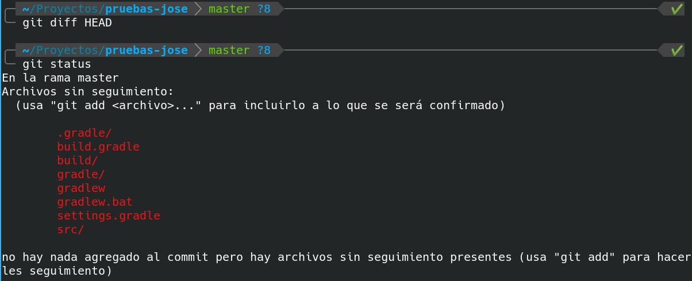
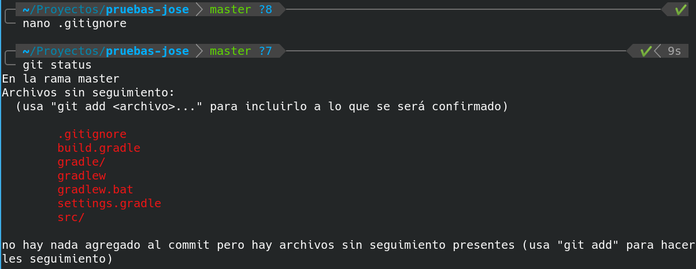
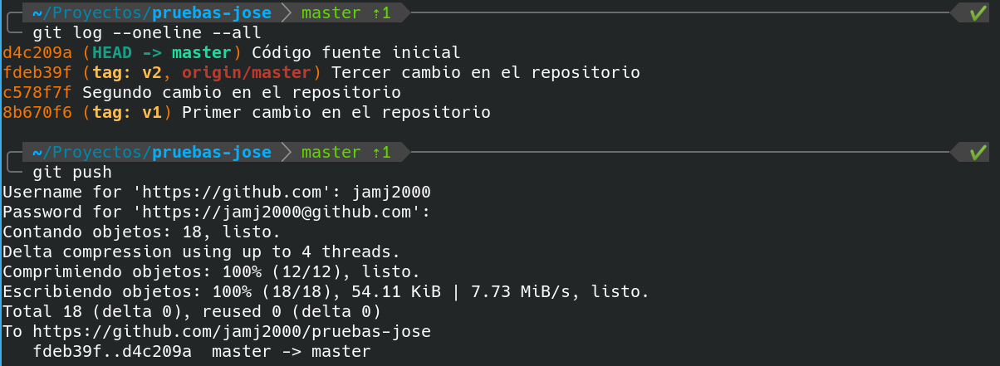

# Archivo .gitignore

En esta actividad empezaremos a trabajar con algo más real. Por ejemplo, una sencilla aplicación de Java. Esta actividad también es práctica.

Vamos a seguir utilizando el repositorio que estabamos usando en las actividades anteriores.

**`git log  --oneline --all`**


##  1. Creamos una aplicación HolaMundo en Java con Gradle.

```
gradle init --type java-application
```


Vemos que nos ha creado un proyecto de gradle con varios archivos.

Para probar la ejecución hacemos:

```
gradle run
```


Si ahora volvemos a hacer un listado, veremos que nos ha creado una nueva carpeta llamada build con el bytecode resultante de la compilación.

```
ls -a
tree build
```


> NOTA: El archivo `README.md` no es creado por gradle. Ya existe de antes en el proyecto.


## 2. Añadiendo archivos al repositorio local

Como vimos en la actividad anterior, si ahora ejecutamos **git diff HEAD**, esperariamos ver los cambios de nuestro directorio de trabajo respecto al último commit.

Sin embargo esto no es lo que ocurre. NO SE MUESTRA NADA. ¿Por qué es esto?

Esto es porque git diff HEAD funciona siempre teniendo en cuenta los archivos que ya habían sido añadidos previamente al repositorio. Es decir sólo tiene en cuenta los archivos con seguimiento. 

**Los archivos nuevos son archivos sin seguimiento**. En este caso debemos usar **git status** para ver esta circunstancia.



Ahora debemos añadir todos estos archivos al área de preparación (Staging Area) y luego realizar un commit.

PERO ESPERA UN MOMENTO. Voy a explicarte algo.

**Cuando se trabaja con proyectos de código fuente existen algunos archivos que no interesa añadir al repositorio, puesto que no aportan nada**. En el repositorio, como norma general, no debe haber archivos ejecutables, ni bytecode, ni código objeto, y muchas veces tampoco .zip, .rar, .jar, .war, etc. Estos archivos inflan el repositorio y, cuando llevamos muchos commits, hacen crecer demasiado el repositorio y además pueden ralentizar el trabajo de descarga y subida.

Para cada lenguaje y para cada entorno de desarrollo se recomienda no incluir ciertos tipos de archivos. Son los **archivos a ignorar**. Cada programador puede añadir o eliminar de la lista los que considere adecuados. Los archivos y carpetas a ignorar deben indicarse en el archivo **`.gitignore`**. En cada línea se pone un archivo, una carpeta o una expresión regular indicando varios tipos de archivos o carpetas.

En el repositorio https://github.com/github/gitignore tienes muchos ejemplos para distintos lenguajes, herramientas de construcción y entornos.

Para el lenguaje Java: https://github.com/github/gitignore/blob/master/Java.gitignore

Para la herramienta Gradle: https://github.com/github/gitignore/blob/master/Gradle.gitignore

Para el entorno Netbeans: https://github.com/github/gitignore/blob/master/Global/NetBeans.gitignore

Simplificando, nosotros vamos a ignorar las carpetas `build` y `.gradle`. Entonces, el archivo **`.gitignore`** debe tener el siguiente contenido:

```
build/
.gradle/
```

La barra final es opcional, pero a mí me gusta ponerla cuando me refiero a carpetas, para así saber cuando se trata de un archivo y cuando de una carpeta.

Crea el archivo .gitignore con dicho contenido y haz una captura de pantalla.

Ahora si hacemos 

**`git status`**


veremos que no nos aparecen las carpetas `build` ni `.gradle`. Y nos aparece un archivo nuevo .gitignore.




Ahora ya podemos ejecutar

```
git  add  .
git  commit  -m  "Código fuente inicial"
```

Fíjate que he escrito `git add .`. El punto indica el directorio actual, y es una forma de indicar que incluya en el área de preparación todos los archivos del directorio en el que me encuentro (salvo los archivos y carpetas indicados en `.gitignore`) Se utiliza bastante esta forma de git add cuando no queremos añadir los archivos uno a uno.

## 3. Subir cambios de repositorio local a repositorio remoto

Ya sólo nos queda subir los cambios realizados al repositorio remoto con **git push**



Para hacer algo más interesante este apartado, vamos a crear una etiqueta en el commit actual y subirla a github para que éste cree una nueva *release*.

```
git  tag  v3
git  push --tags
```


Bueno, las etiquetas v1 y v2 no se suben porque ya la habíamos subido previamente.

En este caso, podríamos también haber ejecutado

**`git push origin v3`**


Y la historia de nuestro repositorio local nos quedaría así de bonita


Accede a tu repositorio en GitHub y haz una captura de pantalla de las *releases*.

Haz otra captura de los archivos y carpetas de código subidas a GitHub. No deberían aparecer ni la carpeta build ni la carpeta .gradle. Y sí debería aparecer el archivo .gitignore.

> NOTA: La carpeta `.git` nunca se muestra en GitHub.


> *NOTA: No borrar los repositorio local ni repositorio remoto. Los volveremos a utilizar en la siguiente actividad.*

**Subir a plataforma Moodle un documento PDF con las capturas de pantalla y explicaciones pertinentes.**
